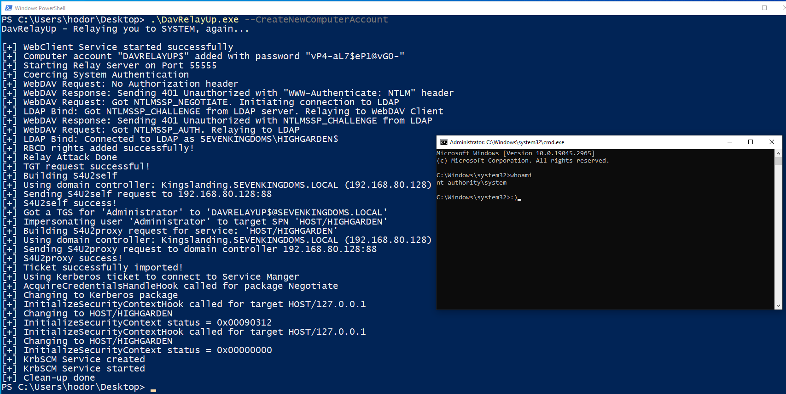

# DavRelayUp
A quick and dirty port of [KrbRelayUp](https://github.com/Dec0ne/KrbRelayUp) with modifications to allow for NTLM relay from webdav to LDAP in order to streamline the abuse of the following attack primitive:

0. (Optional) New machine account creation ([New-MachineAccount](https://github.com/Kevin-Robertson/Powermad/blob/master/Powermad.ps1)) 
1. Force start the WebClient service
2. Start webdav relay server (GoRelayServer - a golang DLL that is embeded in DavRelayUp using Costura.Fody)
3. Local machine account auth coercion ([SharpSystemTriggers](https://github.com/cube0x0/SharpSystemTriggers/tree/main/SharpEfsTrigger))
4. NTLM relay to LDAP
4. Add RBCD privs and obtain privileged ST to local machine ([Rubeus](https://github.com/GhostPack/Rubeus/))
5. Using said ST to authenticate to local Service Manager and create a new service as NT/SYSTEM. ([SCMUACBypass](https://gist.github.com/tyranid/c24cfd1bd141d14d4925043ee7e03c82))

**This is essentially a universal no-fix local privilege escalation in domain-joined windows workstations where LDAP signing is not enforced (the default settings).**


## Usage
```
DavRelayUp - Relaying you to SYSTEM, again...

Usage: DavRelayUp.exe [-c] [-cn COMPUTERNAME] [-cp PASSWORD | -ch NTHASH]

RBCD Options:
    -c   (--CreateNewComputerAccount) Create new computer account for RBCD. Will use the current authenticated user.
    -cn  (--ComputerName)             Name of attacker owned computer account for RBCD. (default=DAVRELAYUP$)
    -cp  (--ComputerPassword)         Password of computer account for RBCD. (default=RANDOM [if -c is enabled])
    -ch  (--ComputerPasswordHash)     Password NT hash of computer account for RBCD. (either -cp or -ch must be specified)
    -i   (--Impersonate)              User to impersonate. Should be a local administrator in the target computer. (default=Administrator)

KrbSCM Options:
    -s   (--ServiceName)              Name of the service to be created. (default=KrbSCM)
    -sc  (--ServiceCommand)           Service command [binPath]. (default = spawn cmd.exe as SYSTEM)

General Options:
    -p  (--Port)                     Port for WebDAV Server (default=55555)
    -d  (--Domain)                   FQDN of domain. (Optional)
    -dc (--DomainController)         FQDN of domain controller. (Optional)
    -ssl                             Use LDAP over SSL. (Optional)
    -n                               Use CreateNetOnly (needs to be on disk) instead of PTT when importing ST (Optional)
    -v  (--Verbose)                  Show verbose output. (Optional)
    -h  (--Help)                     Show help
```

## Examples

https://github.com/Dec0ne/DavRelayUp/assets/54464773/a5ca44d6-3510-4fb2-ba6f-daff64aa2c34




## Building

0. Build GoRelayServer (already built and ready in this repository but in case you want to do it yourself)
   ```
   PS C:\Tools\DavRelayUp> cd GoRelayServer
   PS C:\Tools\DavRelayUp\GoRelayServer> go build --buildmode=c-shared -ldflags="-s -w"  -o "../DavRelayUp/Costura64/GoRelayServer.dll" main.go
   ```
   This will build the GoRelayServer DLL and save it in "DavRelayUp\DavRelayUp\Costura64\GoRelayServer.dll" -> This is the folder from which Costura.Fody will embed it in the final DavRelayUp.exe executable.
1. Open KrbRelayUp.sln in Visual Studio 2019
2. Make sure that Solution Configuration is set to Release and hit build (CTRL+SHIFT+B)

## TODO
- [ ] Add ShadowCred attack as a RELAY method
- [ ] Add U2U support to allow for the attack without the need for a machine account

## Mitigation & Detection
* Enforce LDAP Signing and LDAP Channel Binding to mitigate the relay of the machine account auth to LDAP. This can be configured via the "Domain Controller: LDAP server signing requirements" GPO. (Thank you [Will Dormann](https://twitter.com/wdormann) for your [tweet](https://twitter.com/wdormann/status/1518999885550440451) on this matter)
* Make the attack requirements harder to obtain by setting the [MS-DS-Machine-Account-Quota attribute](https://docs.microsoft.com/en-us/windows/win32/adschema/a-ms-ds-machineaccountquota) in AD to **0**, thus removing the ability of any user to add a new machine account to the domain. This is a dangerous default setting in AD - make sure you change it.
* Setting the flag "Account is sensitive and cannot be delegated" on all admin accounts (or put them in protected users) would make it so there is no account with the privileges required that can be delegated in order to complete the attack path. (Thanks to [Christoph Falta](https://twitter.com/cfalta) for this [tweet](https://twitter.com/cfalta/status/1519309206230339585))
* Resources for possible monitoring and detection rules:
    1. https://github.com/tsale/Sigma_rules/blob/main/windows_exploitation/KrbRelayUp.yml ([@Kostastsale](https://twitter.com/Kostastsale))
    2. https://twitter.com/SBousseaden/status/1518976397364056071 ([@SBousseaden](https://twitter.com/SBousseaden)). Mainly the rule about authentication to Service Manager via Kerberos from 127.0.0.1, Great Work!.
    3. https://www.linkedin.com/posts/john-dwyer-xforce_threathunting-threatdetection-blueteam-activity-6924739962131140608-py45/ ([John Dwyer](https://www.linkedin.com/in/john-dwyer-xforce/) [@TactiKoolSec](https://twitter.com/TactiKoolSec))


## Acknowledgements
* [James Forshaw](https://twitter.com/tiraniddo) for figuring out how to [use Kerberos Service Tickets for LOCAL authentication to Service Manager](https://gist.github.com/tyranid/c24cfd1bd141d14d4925043ee7e03c82) which was the missing piece of the puzzle in order to make this attack primitive **local only** (before that, we had to export the ST to a remote machine in order to use it and gain privileged access to our target machine). 
* [Kevin Robertson](https://twitter.com/kevin_robertson) for his [New-MachineAccount](https://github.com/Kevin-Robertson/Powermad/blob/master/Powermad.ps1) functionality which was used in this project.
* [Cube0x0](https://twitter.com/cube0x0) for his [SharpSystemTriggers](https://github.com/cube0x0/SharpSystemTriggers/tree/main/SharpEfsTrigger) functionality (specifically SharpEfsTrigger) which was used in this project.
* [Elad Shamir](https://twitter.com/elad_shamir) for his research on RBCD - [Wagging the Dog](https://shenaniganslabs.io/2019/01/28/Wagging-the-Dog.html)
* [Will Schroeder](https://twitter.com/harmj0y) and everyone who contributed to [Rubeus](https://github.com/GhostPack/Rubeus/) which we all know and love. Basically all the RBCD-S4U functionality was taken from there.
* [Orange-Cyberdefense](https://github.com/Orange-Cyberdefense) for their work on [GOAD](https://github.com/Orange-Cyberdefense/GOAD), the Active Directory research lab I am using which you can see in the demo video and images.
* [Shantanu Khandelwal](https://twitter.com/shantanukhande) for his cool blog post on [Red Team: How to embed Golang tools in C#](https://medium.com/@shantanukhande/red-team-how-to-embed-golang-tools-in-c-e269bf33876a)
* GoRelayServer was built upon the work done on [go-ldap](https://github.com/go-ldap/ldap) which I modified to allow for the webdav-to-ldap NTLM relay. Also thanks for [Mariusz Banach](https://twitter.com/mariuszbit) for [SharpWebServer](https://github.com/mgeeky/SharpWebServer) which I used to learn how webdav NTLM authentication works and implemented it as the server listener in GoRelayServer.
